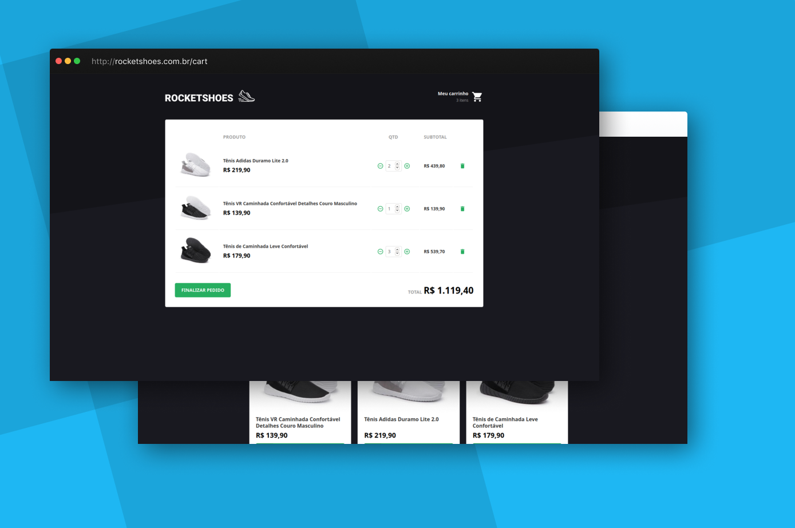

<h1 align="center">
Rocketshoes
</h1>
<blockquote align="center">
👟 E-commerce feito em React + Redux + Saga. Versão mobile: https://github.com/perinazzoo/rocketshoes-mobile
</blockquote>

Este projeto utiliza o Gitmoji para padronização de commits, saiba o que cada emoji significa em: https://gitmoji.carloscuesta.me/

## :thinking: Sobre o projeto

Este é um e-commerce fictício criado durante o módulo 7 do bootcamp GoStack da Rocketseat. Algumas funcionalidades fazem parte do desafio referente a este módulo.

Nele você pode listar produtos, adicionar produtos ao carrinho, listar o carrinho, alterar o carrinho, remover produtos do carrinho e verificar o total e subtotal.

## :computer: Tecnologias utilizadas

* <a target="_blank" href="https://pt-br.reactjs.org/">ReactJS</a>
* <a target="_blank" href="https://redux.js.org/">Redux + Saga</a>
* <a target="_blank" href="https://styled-components.com/">Styled Components</a>
* <a target="_blank" href="https://github.com/styled-components/polished">Polished</a>
* <a target="_blank" href="https://react-icons.netlify.com/#/">React Icons</a>
* <a target="_blank" href="https://github.com/infinitered/reactotron">Reactotron</a>
* <a target="_blank" href="https://github.com/axios/axios">Axios</a>
* <a target="_blank" href="https://github.com/immerjs/immer">Immer</a>
* <a target="_blank" href="https://github.com/fkhadra/react-toastify">React Toastify</a>
* <a target="_blank" href="https://github.com/eslint/eslint">ESLint</a>
* <a target="_blank" href="https://github.com/typicode/json-server">Json server</a>

## :wrench: Iniciando o projeto

1. Clone este repositório usando: `git clone https://github.com/perinazzoo/rocketshoes.git`
2. Vá para o diretório usando: `cd rocketshoes`;
3. Rode o comando `yarn` para instalar todas as dependências;
4. Rode o comando `yarn start` para iniciar o servidor;

 
<blockquote>Feito com :coffee: e :heart: por Gabriel Perinazzo</blockquote>
